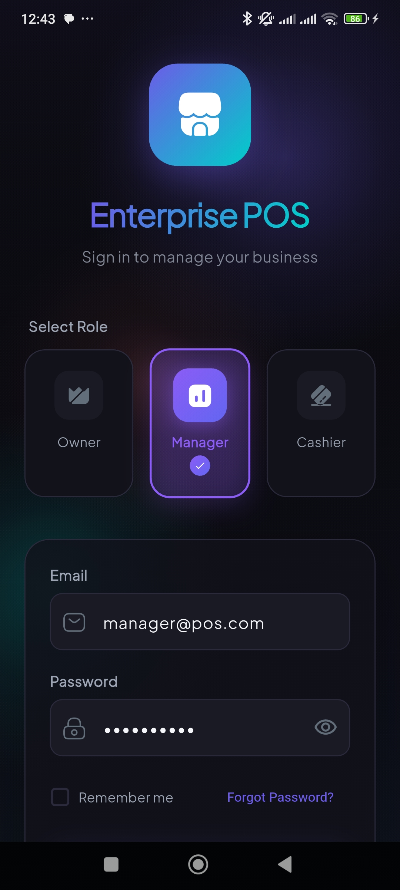
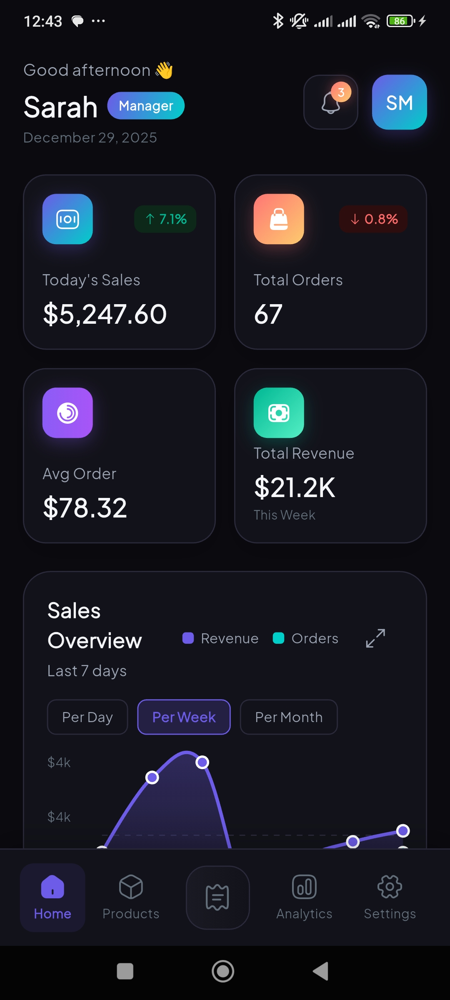
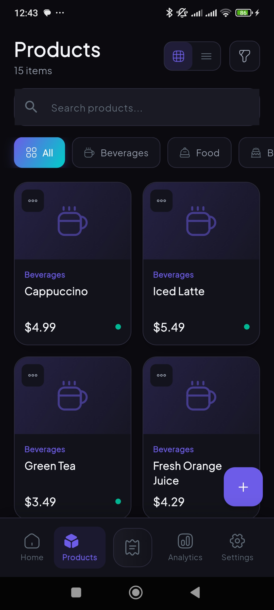
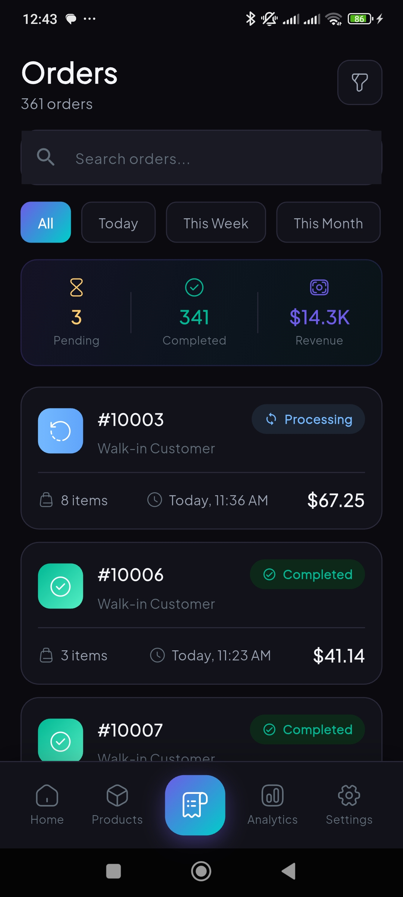
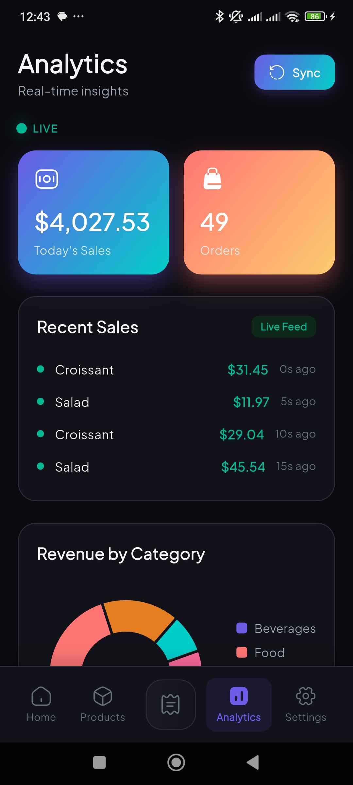
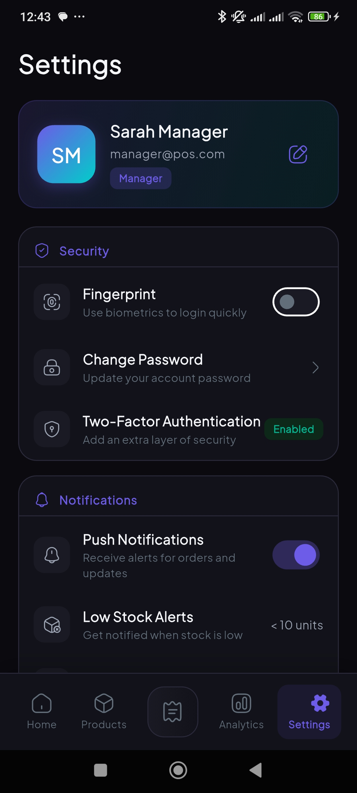

# 🏪 Flutter Enterprise POS Dashboard

<p align="center">
  
  
  
  
</p>

<p align="center">
  A <strong>production-ready</strong> Point of Sale Dashboard built with Flutter, featuring <strong>Clean Architecture</strong>, <strong>offline-first</strong> design with Hive, <strong>cloud sync</strong> with Supabase, <strong>biometric authentication</strong>, and <strong>real-time analytics</strong>.
</p>

---

## 📱 Screenshots

<p align="center">
  <table>
    <tr>
      <td align="center"><strong>Login</strong></td>
      <td align="center"><strong>Dashboard</strong></td>
      <td align="center"><strong>Products</strong></td>
    </tr>
    <tr>
      <td></td>
      <td></td>
      <td></td>
    </tr>
    <tr>
      <td align="center"><strong>Orders</strong></td>
      <td align="center"><strong>Analytics</strong></td>
      <td align="center"><strong>Settings</strong></td>
    </tr>
    <tr>
      <td></td>
      <td></td>
      <td></td>
    </tr>
  </table>
</p>

---

## ✨ Features

### 🔐 Authentication
- ✅ Email/Password login with role selection
- ✅ **Biometric authentication** (Face ID & Fingerprint)
- ✅ Role-based access control (Owner, Manager, Cashier)
- ✅ JWT token simulation
- ✅ Secure credential storage with Hive
- ✅ Remember me functionality

### 📊 Dashboard
- ✅ Real-time sales summary cards with animations
- ✅ Interactive 7-day sales chart (fl_chart)
- ✅ Top 5 selling products with revenue
- ✅ Low stock alerts with severity indicators
- ✅ Quick action buttons
- ✅ Pull-to-refresh functionality

### 📦 Products Management
- ✅ Grid/List view toggle
- ✅ Category filtering with chips
- ✅ Real-time search
- ✅ Stock level indicators (High/Medium/Low/Out)
- ✅ Product cards with category icons
- ✅ SKU display

### 🧾 Orders
- ✅ Order list with status badges
- ✅ Date range filtering (Today, This Week, This Month, All)
- ✅ Search by order ID or customer name
- ✅ Order summary bar (Pending, Completed, Revenue)
- ✅ Pull-to-refresh

### 📈 Real-Time Analytics
- ✅ **Live sales counter** (updates every 5 seconds)
- ✅ Recent sales feed with live updates
- ✅ Revenue by category (Pie chart)
- ✅ Peak hours analysis (Bar chart)
- ✅ Manual sync button with animation

### ⚙️ Settings
- ✅ Profile section with avatar
- ✅ **Biometric toggle** (Face ID/Fingerprint)
- ✅ Change password option
- ✅ Two-factor authentication status
- ✅ Push notifications toggle
- ✅ Low stock threshold slider
- ✅ Auto-sync toggle with interval selection
- ✅ Clear cache option
- ✅ Currency selection
- ✅ Language & date format options
- ✅ About section with app version
- ✅ Logout with confirmation

### 🔄 Offline Mode
- ✅ Full offline functionality with Hive
- ✅ Local data persistence
- ✅ Auto-sync when online
- ✅ Sync queue management

---

## 🏗️ Architecture

This project follows **Uncle Bob's Clean Architecture** principles:

```
lib/
├── core/
│   ├── constants/          # App-wide constants (colors, strings, dimensions)
│   ├── errors/             # Failures & Exceptions
│   ├── network/            # Network connectivity info
│   ├── services/           # Core services (biometric)
│   ├── theme/              # App theme configuration
│   ├── usecases/           # Base usecase classes
│   ├── utils/              # Utilities (formatters)
│   └── widgets/            # Shared reusable widgets
│
├── features/
│   ├── auth/
│   │   ├── data/
│   │   │   ├── datasources/    # Local & Remote data sources
│   │   │   ├── models/         # Data models (Hive, JSON)
│   │   │   └── repositories/   # Repository implementations
│   │   ├── domain/
│   │   │   ├── entities/       # Business entities
│   │   │   ├── repositories/   # Repository interfaces
│   │   │   └── usecases/       # Business logic
│   │   └── presentation/
│   │       ├── bloc/           # State management
│   │       ├── pages/          # Screen widgets
│   │       └── widgets/        # Feature-specific widgets
│   │
│   ├── dashboard/          # Same structure as auth
│   ├── products/           # Same structure
│   ├── orders/             # Same structure
│   ├── analytics/          # Same structure
│   ├── settings/           # Same structure
│   └── shell/              # Main navigation shell
│
├── injection_container.dart    # Dependency injection setup
└── main.dart                   # App entry point
```

### Architecture Layers

| Layer | Purpose | Examples |
|-------|---------|----------|
| **Presentation** | UI & State Management | Pages, Widgets, BLoC |
| **Domain** | Business Logic | Entities, Use Cases, Repository Interfaces |
| **Data** | Data Management | Models, Data Sources, Repository Implementations |

---

## 🛠️ Tech Stack

| Category | Technology |
|----------|------------|
| **Framework** | Flutter 3.35+ |
| **Language** | Dart 3.0+ |
| **State Management** | flutter_bloc, equatable |
| **Local Storage** | Hive, hive_flutter |
| **Cloud Database** | Supabase |
| **Dependency Injection** | get_it |
| **Biometrics** | local_auth |
| **Charts** | fl_chart |
| **Animations** | flutter_animate |
| **Icons** | iconsax |
| **Fonts** | google_fonts |
| **Network** | connectivity_plus |
| **Functional** | dartz |
| **Utilities** | intl, uuid, rxdart |

---

## 🚀 Getting Started

### Prerequisites

- Flutter SDK 3.35.0 or higher
- Dart SDK 3.0.0 or higher
- Android Studio / VS Code
- iOS Simulator or Android Emulator

### Installation

1. **Clone the repository**
   ```bash
   git clone https://github.com/yourusername/flutter_enterprise_pos.git
   cd flutter_enterprise_pos
   ```

2. **Install dependencies**
   ```bash
   flutter pub get
   ```

3. **Generate Hive adapters** (if needed)
   ```bash
   flutter packages pub run build_runner build --delete-conflicting-outputs
   ```

4. **Configure Supabase** (Optional - works offline without it)
   
   Open `lib/main.dart` and replace with your credentials:
   ```dart
   await Supabase.initialize(
     url: 'https://your-project.supabase.co',
     anonKey: 'your-anon-key',
   );
   ```

5. **Run the app**
   ```bash
   flutter run
   ```

---

## 🔐 Biometric Setup

### Android

Add to `android/app/src/main/AndroidManifest.xml`:
```xml
<manifest xmlns:android="http://schemas.android.com/apk/res/android">
    <uses-permission android:name="android.permission.USE_BIOMETRIC"/>
    <uses-permission android:name="android.permission.USE_FINGERPRINT"/>
    ...
</manifest>
```

Update `android/app/build.gradle`:
```gradle
android {
    defaultConfig {
        minSdkVersion 23  // Required for biometrics
    }
}
```

### iOS

Add to `ios/Runner/Info.plist`:
```xml
<dict>
    <key>NSFaceIDUsageDescription</key>
    <string>Use Face ID to login quickly and securely</string>
    ...
</dict>
```

---

## 🔑 Demo Credentials

| Role | Email | Password | Access Level |
|------|-------|----------|--------------|
| 👑 **Owner** | owner@pos.com | owner123 | Full access to all features |
| 📊 **Manager** | manager@pos.com | manager123 | Dashboard, Products, Orders, Analytics |
| 💳 **Cashier** | cashier@pos.com | cashier123 | Orders, Basic Dashboard |

> **Tip:** Select a role on the login page to auto-fill demo credentials

---

## 🎨 Design System

### Color Palette

| Color | Hex | Usage |
|-------|-----|-------|
| 🔵 Primary | `#6C5CE7` | Buttons, Active states |
| 🟢 Secondary | `#00CEC9` | Accents, Gradients |
| 🟠 Accent | `#FF7675` | Warnings, Highlights |
| ⬛ Background | `#0A0A0F` | App background |
| 🔲 Surface | `#12121A` | Cards, Containers |
| ✅ Success | `#00B894` | Success states |
| ⚠️ Warning | `#FDCB6E` | Warning states |
| ❌ Error | `#FF6B6B` | Error states |

### Typography

- **Font Family:** Plus Jakarta Sans (Google Fonts)
- **Weights:** Regular (400), Medium (500), SemiBold (600), Bold (700), ExtraBold (800)

### Design Features

- 🌙 Dark theme optimized
- 💎 Glassmorphism effects
- 🌈 Gradient accents
- ✨ Smooth animations
- 📱 Responsive layouts

---

## 📁 Project Structure

```
flutter_enterprise_pos/
├── lib/
│   ├── core/
│   │   ├── constants/
│   │   │   ├── app_colors.dart
│   │   │   ├── app_dimensions.dart
│   │   │   └── app_strings.dart
│   │   ├── errors/
│   │   │   ├── exceptions.dart
│   │   │   └── failures.dart
│   │   ├── network/
│   │   │   └── network_info.dart
│   │   ├── services/
│   │   │   └── biometric_service.dart
│   │   ├── theme/
│   │   │   └── app_theme.dart
│   │   ├── usecases/
│   │   │   └── usecase.dart
│   │   ├── utils/
│   │   │   ├── currency_formatter.dart
│   │   │   └── date_formatter.dart
│   │   └── widgets/
│   │       ├── custom_text_field.dart
│   │       ├── glass_card.dart
│   │       ├── gradient_button.dart
│   │       ├── shimmer_loading.dart
│   │       └── status_badge.dart
│   │
│   ├── features/
│   │   ├── auth/                    # 14 files
│   │   ├── dashboard/               # 12 files
│   │   ├── products/                # 8 files
│   │   ├── orders/                  # 6 files
│   │   ├── analytics/               # 1 file
│   │   ├── settings/                # 5 files
│   │   └── shell/                   # 2 files
│   │
│   ├── injection_container.dart
│   └── main.dart
│
├── assets/
│   ├── icons/
│   └── images/
│
├── pubspec.yaml
└── README.md
```

**Total: 69 Dart files**

## 📦 Building

### Android

```bash
# Debug APK
flutter build apk --debug

# Release APK
flutter build apk --release

# App Bundle (for Play Store)
flutter build appbundle --release
```

### iOS

```bash
# Debug build
flutter build ios --debug

# Release build
flutter build ios --release

# Archive for App Store
flutter build ipa
```

---

## 🔄 State Management

This project uses **BLoC (Business Logic Component)** pattern:

```dart
// Events - What happened
abstract class AuthEvent {}
class AuthLoginRequested extends AuthEvent { ... }

// States - What to show
abstract class AuthState {}
class AuthAuthenticated extends AuthState { ... }

// Bloc - Business logic
class AuthBloc extends Bloc<AuthEvent, AuthState> {
  on<AuthLoginRequested>(_onLoginRequested);
}
```

### Available BLoCs

| BLoC | Purpose |
|------|---------|
| `AuthBloc` | Authentication state |
| `DashboardBloc` | Dashboard data |
| `ProductsBloc` | Products list & filters |
| `OrdersBloc` | Orders list & filters |
| `SettingsBloc` | App settings |

---

## 🗄️ Database Schema (Supabase)

```sql
-- Users table
CREATE TABLE users (
  id UUID PRIMARY KEY DEFAULT gen_random_uuid(),
  email TEXT UNIQUE NOT NULL,
  name TEXT NOT NULL,
  role TEXT NOT NULL DEFAULT 'cashier',
  avatar_url TEXT,
  biometric_enabled BOOLEAN DEFAULT FALSE,
  created_at TIMESTAMPTZ DEFAULT NOW(),
  last_login_at TIMESTAMPTZ
);

-- Products table
CREATE TABLE products (
  id UUID PRIMARY KEY DEFAULT gen_random_uuid(),
  name TEXT NOT NULL,
  description TEXT,
  price DECIMAL(10,2) NOT NULL,
  stock INTEGER DEFAULT 0,
  category TEXT NOT NULL,
  image_url TEXT,
  sku TEXT UNIQUE,
  barcode TEXT,
  is_active BOOLEAN DEFAULT TRUE,
  created_at TIMESTAMPTZ DEFAULT NOW(),
  updated_at TIMESTAMPTZ DEFAULT NOW()
);

-- Orders table
CREATE TABLE orders (
  id UUID PRIMARY KEY DEFAULT gen_random_uuid(),
  order_number TEXT UNIQUE NOT NULL,
  subtotal DECIMAL(10,2) NOT NULL,
  tax DECIMAL(10,2) DEFAULT 0,
  discount DECIMAL(10,2) DEFAULT 0,
  total DECIMAL(10,2) NOT NULL,
  status TEXT DEFAULT 'pending',
  customer_name TEXT,
  customer_email TEXT,
  notes TEXT,
  created_by UUID REFERENCES users(id),
  created_at TIMESTAMPTZ DEFAULT NOW(),
  updated_at TIMESTAMPTZ DEFAULT NOW()
);

-- Order items table
CREATE TABLE order_items (
  id UUID PRIMARY KEY DEFAULT gen_random_uuid(),
  order_id UUID REFERENCES orders(id) ON DELETE CASCADE,
  product_id UUID REFERENCES products(id),
  product_name TEXT NOT NULL,
  price DECIMAL(10,2) NOT NULL,
  quantity INTEGER NOT NULL,
  total DECIMAL(10,2) NOT NULL
);
```

---

## 🤝 Contributing

Contributions are welcome! Please follow these steps:

1. Fork the repository
2. Create your feature branch (`git checkout -b feature/AmazingFeature`)
3. Commit your changes (`git commit -m 'Add some AmazingFeature'`)
4. Push to the branch (`git push origin feature/AmazingFeature`)
5. Open a Pull Request

### Code Style

- Follow [Effective Dart](https://dart.dev/guides/language/effective-dart) guidelines
- Use meaningful variable and function names
- Add comments for complex logic
- Write tests for new features

---

## 📄 License

This project is licensed under the MIT License - see the [LICENSE](LICENSE) file for details.

```
MIT License

Copyright (c) 2024 Radhouan

Permission is hereby granted, free of charge, to any person obtaining a copy
of this software and associated documentation files (the "Software"), to deal
in the Software without restriction, including without limitation the rights
to use, copy, modify, merge, publish, distribute, sublicense, and/or sell
copies of the Software, and to permit persons to whom the Software is
furnished to do so, subject to the following conditions:

The above copyright notice and this permission notice shall be included in all
copies or substantial portions of the Software.

THE SOFTWARE IS PROVIDED "AS IS", WITHOUT WARRANTY OF ANY KIND, EXPRESS OR
IMPLIED, INCLUDING BUT NOT LIMITED TO THE WARRANTIES OF MERCHANTABILITY,
FITNESS FOR A PARTICULAR PURPOSE AND NONINFRINGEMENT. IN NO EVENT SHALL THE
AUTHORS OR COPYRIGHT HOLDERS BE LIABLE FOR ANY CLAIM, DAMAGES OR OTHER
LIABILITY, WHETHER IN AN ACTION OF CONTRACT, TORT OR OTHERWISE, ARISING FROM,
OUT OF OR IN CONNECTION WITH THE SOFTWARE OR THE USE OR OTHER DEALINGS IN THE
SOFTWARE.
```

---

## 📞 Support

- 📧 Email: radhwen.rmili.mob@gmail.com

---

## 🙏 Acknowledgments

- [Flutter Team](https://flutter.dev/) for the amazing framework
- [Bloc Library](https://bloclibrary.dev/) for state management
- [Supabase](https://supabase.com/) for backend services
- [Iconsax](https://iconsax.io/) for beautiful icons
- All the open-source contributors

---

<p align="center">
  <strong>Built with ❤️ using Flutter</strong>
</p>

<p align="center">
  <a href="#-flutter-enterprise-pos-dashboard">Back to Top ⬆️</a>
</p>
